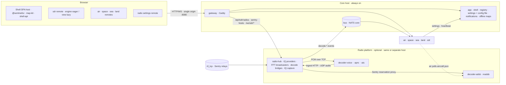

# Sentinel — Section Containers Plan

**Status:** accepted (rev 2, after architecture review; owner decisions resolved 2026-09-30) · **Date:** 2026-09-30 · **Cut against:** `main` @ `99325502`
**Scope:** code-structure and deployment change only — **zero functional or UI change**. Public API paths, WebSocket
protocols, settings keys and the `sentinel_config.json` shape all stay byte-identical.

## 0. Summary

Sentinel today is one FastAPI process serving one Vue SPA; every section shares one SQLite file, one settings router,
one Pinia instance and one bundle. This plan turns it into a **platform + plug-in sections** system:

- **Core (always on):** `app` (shell UI, settings + live config file, notifications, offline maps + tiles, section
  registry), `gateway` (Caddy — the single browser origin), `bus` (NATS core — low-rate events and request/reply).
- **Sections (optional, one container each):** `air`, `space`, `sea`, `land`, `sdr`. Each is a *mini-app*: a FastAPI
  service with its own SQLite DB **plus** a Module-Federation UI remote the shell loads at runtime.
- **Radio platform (optional):** `radio-hub` owns every IQ source (rtl_tcp and the Sentry fleet today; more later),
  the FFT broadcasters, tuning ownership, IQ capture and **all decode bridges**. **Decoder containers** (`decoder-voice`,
  `decoder-aprs`, `decoder-ais`, `decoder-adsb`, future kinds) stay thin native-tool wrappers that attach to the hub;
  decoded events fan out on the bus to **any** section that subscribes.

Adding a section = start its container (`docker compose --profile sea up -d`): it registers with `app`, the gateway
routes its paths, the shell loads its UI remote, and its nav item, sidebar tabs, settings rows and notification types
appear. Not starting it = the feature is absent. Services can run on different hosts.

**SDR keeps playing across sections** for the same reason it does today: the SDR engine is mounted by the shell
*outside* the router view and holds module-level singletons (AudioContext, worklet, sockets). Under federation the
`sdr` remote exposes an **eager `engine` entry** mounted into the shell's always-rendered `#radio` slot at boot, and a
**lazy `view` entry** (waterfall/decode dock) for `/sdr/` only.

The migration is a **strangler**: decouple inside the monolith first (bus abstraction, registries, contracts, boundary
lint rules), federate the UI while still one container, then extract containers one at a time behind the gateway.
Every phase ships on its own, keeps all gates green, and can be rolled back.

---

## 1. Codebase review — what stands in the way

Four parallel read-only reviews (backend, frontend, infra/CI, external research) and one independent architecture
review of this plan. Citations are against `99325502`.

### 1.1 Size
- Backend: **128 REST + 4 WS routes** across 9 routers (`routers/sdr.py`: 44 REST + all 4 WS); 19 tables in one `Base`;
  48 pytest files; one root `conftest.py` importing `backend.main.app` (every router).
- Frontend: ~580 files. `components/shared` 195 (≈50 settings controls), 16 stores + `_persist.ts`, 67 composables.
  Largest: `SdrWaterfall.vue` 3386 lines, `SdrPanel.vue` 1983, `stores/sdr.ts` 1338. 14 Playwright specs + `mockApi.ts`.

### 1.2 Backend coupling
| # | Coupling | Evidence | Resolution |
|---|---|---|---|
| B1 | Import cycle `routers/sdr` ↔ `routers/settings` ↔ `services/app_config` ↔ `database` | `sdr.py:744`, `settings.py:361`, `app_config.py:276-290`, `database.py:440` | Move `_reconcile_sdr_frequencies` into sdr; side effects become level-triggered reconcilers fed by `settings.changed` (§4.3) |
| B2 | Decode ingest writes straight into Land/Sea stores from the SDR router | `sdr.py:1490-1492` → `aprs_store.upsert_station`; `sdr.py:1681` → `ais_decode.ingest_event` | Hub keeps ingest + its 409 gate, then publishes `decode.<kind>.<radio>`; Land/Sea subscribe |
| B3 | Sea reads bridge state in-process | `sea.py:31,89` `get_active_ais_bridge()` | Bus request/reply `hub.decode.ais.status` |
| B4 | Settings written by a service that doesn't own the namespace: `sdr.aprs_radio_id` (Land's active APRS radio), `sdr.ais_radio_id` (Sea's *actively decoding* radio — distinct from the *designated* `sea.aisSdrRadioId`, see `useOffgridAisDecode.ts:12-16`), `app.instanceId` (written by Air, `adsb_source.py:99-104`) | — | **Keys are not renamed** (the config file shape is user-visible). Ownership of the *writer* moves: the hub persists `sdr.aprs_radio_id`/`sdr.ais_radio_id` and resumes decode itself; `app.instanceId` stays in core and is read verbatim by the hub |
| B5 | Every section's notifications live in Air's `air_messages` table | `air.py:262-312`; `stores/notifications.ts:188-262` | Table + `/api/air/messages*` endpoints move to **core**, same path and shape (gateway routes that prefix to `app`) |
| B6 | Air reads the hub's `sentry_hosts` table incl. `auth_token` | `adsb_source.py:131,256` | Hub exposes a Sentry-reservation proxy; Sentry stays the arbiter across Sentinel instances; Air never sees credentials |
| B7 | Fleet poller rewrites `sdr.radios` | `sentry_fleet.py:235,261` | `sdr.radios` **stays a core setting** (it is in the config file, `data/sentinel_config.json:190`); the hub reads it through the settings client and writes port-follow updates through core's settings API |
| B8 | Lifespan orchestrates every section | `main.py:59-131` | Each service owns its lifespan and the SIGTERM wake chain (pattern of `main.py:97-111`) |
| B9 | Live config file hooks the global SQLAlchemy `Session` | `app_config_file.py:233-258` | Settings remain in core's DB, so this stays in core unchanged |
| B10 | `app.connectivityMode` read by air/space/sea/offline maps | `utils.py:94-148` | SDK settings client: versioned cache + `settings.changed` invalidation + periodic resync |
| B11 | Sidecars hard-code host `app`, share a secret through a named volume; `adsb-decoder` hard-codes a LAN IP | `docker-compose.yml:61-199` | Env-configured endpoints, per-service credentials, no shared volume |
| B12 | Raw IQ recording runs inside the broadcaster | `routers/sdr.py:821-840`, `services/sdr.py:729-760` | Hub `iq-capture` API writes to the hub's volume; `sdr` keeps recordings metadata + browser-uploaded WAV (`sdr.py:848-886`) and proxies `GET /api/sdr/recordings/{id}/iq` |

### 1.3 Frontend coupling
| # | Coupling | Evidence | Resolution |
|---|---|---|---|
| F1 | Shell imports sections: all views statically (`router/index.ts:2-6`), air/land store hydration (`main.ts:23-28,128-176`), `SdrTabPanel` and air/space alert services (`App.vue:143-149`) | — | Registries filled by each remote's `register()`; hydration moves into `register()` and runs before first render |
| F2 | `MapSidebar.vue:204-395` hard-codes per-domain tabs, sub-tabs and store writes | — | Sidebar tab/sub-tab registry; existing Teleport targets unchanged |
| F3 | `SettingsPanel.vue:334-760` hard-coded `ALL_SETTINGS`; `SettingRow.vue:16-232` statically imports ~50 controls | — | Settings registry; each remote contributes items + lazy components |
| F4 | `SentinelControlBase` lives in `components/air/` and is imported by shared/space/sea/land | — | Move to `@sentinel/map-kit` |
| F5 | Cross-section imports: sea→air (`adsbSprites`), sea→land (`LandRangeRingsControl`), land→sdr (`SdrAprsSymbol`, `stores/sdr`), air/sea→`stores/sdr`, `stores/sdr`→air (`adsbSourceApi`) | frontend review §2 | Shared pieces to map-kit/ui; store reaches become capabilities |
| F6 | DOM `CustomEvent` bus `sentinel:sdr-tune-external/restore` from Air/Sea/Land filters and `SatellitePassScheduler.ts:289-300,341`; consumed by `SdrPanel.vue:1981-1982` | — | Typed `radio` capability (§3.6) |
| F7 | App-level background services import section internals: `useAirAlertsService` (pulls in `useNotificationSubscriptions`, `useOverheadAlertZones`) and `useSpaceAlertsService` | `App.vue:167-185` | Each remote exposes `./background`, started at boot |
| F8 | Notification click navigation hard-codes `/air/`, `/space/` and space auto-tune semantics (`passNotifStore` imported from *space*) | `NotificationsPanel.vue:97-172`; `stores/notifications.ts:82-127` | Per-section notification type + click-handler + dismiss-hook registry |
| F9 | **Pre-existing defect:** `AirMap` never clears its aircraft click handler; after leaving `/air`, clicking an aircraft alert silently does nothing | `AirMap.vue:243,524` | Fix in P2 (independent bug) |
| F10 | Radio/Sentry settings UI and the ADS-B/APRS/AIS radio pickers use `stores/sdr`/`sdrRadiosApi`; `useOffgridAisDecode` calls `sdrStore.startAis/stopAis`; `LandFilter.vue:311-410` writes SDR frequencies | — | A small `radio` settings remote from the hub; sea/land own their decode API clients; `radio.frequencies` capability |
| F11 | `<domain>.enabled` gating: `main.ts:56-104` (`DOMAINS_ON_BY_DEFAULT` = air, space, sdr), `router/index.ts:22-29`, `SettingsPanel.vue:762,785`; `/` redirects to `/air/` | — | Visible = **registered AND enabled** (§3.5) |

### 1.4 Where SDR playback actually lives
- `App.vue:113-119` mounts `MapSidebar` with `<SdrTabPanel/>` in the `#radio` slot; `MapSidebar.vue:184-190` renders the
  radio pane **unconditionally**, so the single `SdrPanel` lives for the page lifetime — even when SDR is *disabled*
  (which is why Space auto-tune works with SDR disabled today).
- `useSdrAudio.ts` / `useSdrDecode.ts` hold **module-level singletons** (AudioContext, worklet, IQ + decode sockets);
  `useSdrControlSocket` survives because the `SdrPanel` instance survives; `index.html:44-54` pre-creates an
  AudioContext when `sessionStorage.sdrPlaying` is set.
- The route-level `SdrView` only renders the waterfall from `stores/sdr` spectrum state.
- **No e2e currently asserts "audio survives navigation"** — P0 adds one.

### 1.5 Infra / CI
- One origin serves SPA, `/api`, `/ws`, `/assets`; Vite dev, the fullstack smoke and the a11y suite assume it.
- `frontend/spa-dist` is committed and CI fails if a rebuild differs; no Docker build in CI; decoder images must never
  be built in CI (mbelib).
- Offline tiles (2.2 GB) are bind-mounted; offline downloads and recordings live on the `sentinel_db` volume.
- Decoder images pin upstream **branches** (`master`, `audio_work`, `dev`), not SHAs.

---

## 2. Target architecture



### 2.1 Container catalogue

| Container | Profile | Owns (code) | Owns (data) | UI remote | Needs |
|---|---|---|---|---|---|
| `app` | core | registry, settings API + validation from manifests, `sentinel_config.json` sync, notifications (`/api/air/messages*`), offline maps + tile resolver, `/assets` (styles, fonts, sprites, pmtiles), shell SPA | `user_settings` (incl. `sdr.radios`, `app.instanceId`), `air_messages`, `offline_map_region`, offline tiles dir | — (host) | bus |
| `gateway` | core | Caddy; static Caddyfile with env-templated upstreams for known ids + admin API (internal only) for new ids; `handle_errors` 503 page | — | — | — |
| `bus` | core | NATS core (JetStream deferred) | — | — | — |
| `air` | `air` | `routers/air.py` (minus messages), `/api/sdr/adsb/*` logic (via hub reservation proxy), `adsb`, `upstream_rate_limit` | `adsb_cache`, `air_tracking` | `air` | core; optional hub + `decoder-adsb` |
| `space` | `space` | `space`, `tle`, `satellite`, `daynight`, `sat_radio` | `tle_cache`, `satellite_catalogue` | `space` | core; optional `radio` capability |
| `sea` | `sea` | `sea`, `ais_stream`, `ais_store`, `ais_decode` (bus subscriber), off-grid AIS start/stop client | `sea_vessel_cache` | `sea` | core; optional hub + `decoder-ais` |
| `land` | `land` | `land`, `repeaters`, `aprs_store` (bus subscriber), APRS cleanup, APRS start/stop client | `aprs_stations`, `repeater_cache` | `land` | core; optional hub + `decoder-aprs` |
| `sdr` | `sdr` | frequencies, groups, search ranges, band plan, `sdr_data`, recordings metadata + WAV | `sdr_frequency_*`, `sdr_search_ranges`, `sdr_recordings`, recordings volume; keeps writing its `user_settings` mirrors (`sdr.groups/frequencies/searchRanges/bandPlan`) into core as today | `sdr` (engine + view) | core, hub |
| `radio-hub` | `radio` | `services/sdr.py` (connections, broadcasters, `RelayControlClient`, tuning ownership), Sentry client/fleet/routes, **all `sdr_decode.py` bridges** incl. UDP voice return + 48 kHz resampler, decode ingest + 409 gating, `/ws/sdr/*` (all 4), IQ capture, Sentry reservation proxy | `sentry_hosts`, IQ capture files | `radio` (settings-only: radios + Sentry hosts) | core |
| `decoder-voice/-aprs/-ais` | `decoder-*` | unchanged native tool + entrypoint; only endpoint env vars change (hub instead of `app`) | — | — | hub |
| `decoder-adsb` | `decoder-adsb` | readsb; advertises its `aircraft.json` URL in the registry | — | — | hub (reservation) |

### 2.2 Deployments that must work
- **Core only:** shell, settings, offline maps, notifications, "no sections installed" state.
- **Core + sea:** Sea online via AISStream. Off-grid AIS appears once `radio-hub` + `decoder-ais` register — the SDR
  *section* is not required.
- **Core + sdr + radio:** SDR works; there are no "tune" buttons elsewhere because those sections are absent.
- **Core + space + sdr + radio:** pass auto-tune works through the `radio` capability; without `sdr`, Space hides its
  auto-tune / "& RECORD" toggles and auto-tune notifications.

---

## 3. Contracts

JSON Schema in `platform/contracts/`, generating Pydantic (Python SDK) and TS types (web SDK); versioned as
`contracts: 1.x`. CI fails a service or remote built against an incompatible major.

### 3.1 Service manifest
```jsonc
{
  "id": "sea", "kind": "section",               // section | radio-hub | decoder
  "version": "3.4.0", "contracts": "^1",
  "displayName": "SEA", "icon": "sea", "navOrder": 30,
  "internalUrl": "http://sea:8000",             // advertised address; may be another host
  "routes": ["/api/sea/"],                      // gateway prefixes (validated: must not collide)
  "ui": { "remoteEntry": "/remotes/sea/remoteEntry.js", "exposes": ["./register", "./view", "./background"] },
  "settings": { "namespace": "sea", "defaults": {"…": "fragment of default_config.json"}, "schema": {},
                "secretKeys": ["aisstreamApiKey"], "removedKeys": [], "renames": {} },
  "requires": [], "optional": ["radio-hub", "decoder:ais"],
  "provides": [], "consumes": ["event:decode.ais"],
  "health": "/health"
}
```
Decoders declare `kind: decoder`, `decoderKind: "ais"`, and their PCM spec (rate, channels, demod). `decoder-adsb` also
declares `endpoints: { aircraftJson: "http://adsb-decoder:8080/data/aircraft.json" }`.

### 3.2 Registry lifecycle
1. On start a service `POST`s its manifest to `app` `/internal/registry/register` with the join token. The registry
   validates the schema, id pattern and route prefixes (no collisions, no `/api/app`), and **rejects re-registration
   of a live id from a different instance**.
2. `app` seeds settings defaults (idempotent), makes sure the gateway route exists, and publishes `registry.changed`.
3. Liveness: `app` **HTTP health-probes** every 10 s and marks a service unavailable after 3 failures. This does not
   depend on NATS, so a bus restart can't grey out healthy sections.
4. The shell reads `GET /api/app/sections` before mounting (as it waits for `/api/settings` today) and follows an SSE
   stream for changes.

### 3.3 Bus subjects (low-rate only)
| Subject | Publisher → consumers | Replaces |
|---|---|---|
| `registry.changed` | app → all | — |
| `settings.changed.<ns>` `{key, version}` | app → interested services | synchronous side effects in `app_config.py:276-290`, `settings.py:361` |
| `decode.<kind>.<radioId>` | hub (after the ingest gate) → sea / land / future | `sdr.py:1490-1492`, `:1681` |
| `hub.decode.<kind>.{start,stop,status}` (request/reply) | sea / land → hub | `/api/sdr/{aprs,ais}/{start,stop,status}` internals |
| `hub.iq-capture.{start,stop}` (request/reply) | sdr → hub | `sdr.py:821-840` |

FFT frames, browser IQ and PCM **never** go on the bus. They stay on WebSockets through the gateway and on
hub ↔ decoder TCP. Only NATS core is used; JetStream is deferred, because Sea already warm-starts from
`sea_vessel_cache` and consumers reconcile level-triggered on restart.

### 3.4 Radio hub
The hub is the current `services/sdr.py` + `services/sdr_decode.py` + Sentry code, **moved, not rewritten**:
- It serves the four WebSockets `/ws/sdr/{id}`, `/ws/sdr/{id}/iq`, `/ws/sdr/{id}/decode` and `/ws/sdr/{id}/decode/audio`
  byte-identically. The `digital_decode`/`digital_channel` control commands, `decode_status`/`decoder_reachable` and
  the resampler all stay local to the hub.
- It keeps the decode bridge contract to decoders (PCM TCP server, UDP voice return, `/ingest` + `/config` endpoints,
  409 when no bridge is active). Decoders only change the host they point at.
- **New decoder kinds** register a manifest with their PCM spec. The hub runs a generic `PcmDecodeBridge` for them
  (with `ChannelOwningDecodeBridge` semantics when the spec says `ownership: absolute`), and publishes their ingest
  events as `decode.<kind>.<radioId>` for any section. Several decoders of one kind are assigned per radio by the hub.
- **IQ providers:** `RtlTcpProvider` and `SentryProvider` (fleet poller + relay control) implement one `IqProvider`
  interface. New sources (SoapySDR, KiwiSDR, file replay) are new adapters, not new containers.
- **Sentry reservation proxy:** Air asks the hub, and the hub calls Sentry `acquire_reservation`/`patch_device` with
  the verbatim `app.instanceId` as holder. Sentry stays the lease authority, so no first-claim 409 after the upgrade
  (`RESERVATION_TTL_SECONDS=120`, `adsb_source.py:56`).

**Why Sentry belongs in the hub, not `sdr` or `app`:**
- Air, Sea and Land need radios when the SDR *section* is absent, so it can't live in `sdr`.
- It shouldn't live in `app` either. The core must stay radio-free so it can run anywhere, and a future IQ source should
  touch only the hub.

**Placement is measured, not assumed.** Today the app on the UI host talks to remote `rtl_tcp` over the LAN, so the
default keeps the hub on the core host (the same data path as today). Moving it to the Pi puts FFT (up to 32k bins at
25 fps per radio) and every demod bridge on the Pi, and `services/sdr.py:53-54` already notes the Pi's limits.
Recordings on the Pi's SD card would also mean write wear.

### 3.5 Section visibility and boot
- **Visible = registered AND `<domain>.enabled`.** `DOMAINS_ON_BY_DEFAULT` is unchanged. `/` redirects to the first
  visible section instead of hard-coding `/air/`.
- The SDR engine loads whenever `sdr` is **registered**, even if it is disabled, to match today's always-mounted
  `SdrTabPanel`.
- **Boot order:**
  1. The shell fetches `/api/settings` and `/api/app/sections` in parallel.
  2. It calls `registerRemotes` and loads every `./register`.
  3. It loads the `sdr` `./engine` with a timeout; on timeout it mounts without it and late-mounts the engine when it
     arrives.
  4. It starts the `./background` entries.
  5. It mounts the app.
  Capability calls made before the engine mounts are queued, as `drainPendingExternalTune` does today.
- **Unavailable at runtime:** the nav item greys out and routes render a "section unavailable" state that clears
  `body[data-no-data]`. A loaded remote is **never unloaded** in the session.

### 3.6 `@sentinel/shell-api`
Every remote's `./register` receives a `ShellContext`:
```ts
export default function register(shell: ShellContext) {
  shell.routes.add({ path: '/sea/', component: () => import('./SeaView.vue'), domain: 'sea' })
  shell.nav.add({ id: 'sea', label: 'SEA', icon: SeaIcon, order: 30 })
  shell.sidebar.addSearchPane('sea', () => import('./SeaSearch.vue'))
  shell.sidebar.addFilterSubTabs('sea', seaFilterTabs)
  shell.settings.addSection({ id: 'sea', label: 'SEA', items: seaSettingItems })   // components lazy
  shell.notifications.addType('vessel', { onClick: t => shell.router.push({ path: '/sea/', query: t }) })
  shell.tracking.addKind('vessel', …)                                             // hides items for absent sections
  shell.background.add(() => import('./background'))
  shell.capabilities.whenAvailable('radio', radio => enableTuneButtons(radio))
}
```
The registries are `routes`, `nav`, `sidebar`, `footer`, `settings`, `notifications` (types, click handlers and
dismiss hooks), `tracking`, `background`, `capabilities` and `events` (a typed wrapper for the remaining document
events such as `sentinel:config-uploaded` and `sentinel:sidebar-state`).

The **`radio` capability**, provided by the `sdr` engine, covers everything other sections use today:
- `tune({hz, mode, source, satName?, noradId?, token, record?, digital?})`
- `restore(token)`
- `connected` (reactive)
- `activeRadioIds` (e.g. the APRS radio)
- `frequencies`: `has`, `save`, `remove`, `ensureGroup`

The **`radioSites` capability** comes from the `radio` remote and feeds the `SentrySitesControl` map control, overhead
zones and range-ring origin. The last-known sites are cached, so zones don't flap while the hub restarts.

Shared packages (host-provided singletons under federation, npm workspace packages in the repo):
- **`@sentinel/ui`** (`platform/web/ui`, done in P4.1): the `Base*` primitives, `IconRail`/`IconRailAccordion`, the
  generic icons and the DOM composables (`useDisclosure`, `useDocumentEvent`, `useWindowEvent`, `useTeleportedMenu`,
  `useRadioGroupKeyboard`). The settings-bound `BaseToggleSetting`/`BaseNumberSetting` stay with the settings code
  (they persist through the settings API), and overlays go with `shell-api`.
- **`@sentinel/web-config`** (`platform/web/config`): the shared tsconfig base, ESLint, Prettier, Vitest config and
  test setup, used by the SPA and every package.
- **`@sentinel/map-kit`** (`platform/web/map-kit`, done in P4.3; also holds `UserLocationMarker`, `map-cluster`,
  `map-label`, `useRangeRingOrigin` and `useUserLocation`):
  - `MapLibreMap` and `SentinelControlBase`
  - the shared controls: names, roads, terrain, sentry-sites, range-rings (incl. `LandRangeRingsControl`) and zoom
  - `adsbSprites`
  - `useOfflineTierRefresh`, `useBasemapLayerSync`, `useMapContextMenu` and the style utils
- **`@sentinel/shell-api`** (`platform/web/shell-api`, done in P4.2 — `shell/sections.ts`, the composition root, stays
  in the SPA):
  - the registries
  - the core stores: `app`, `settings`, `theme`, `basemap`, `notifications`, `offlineMaps`, `sentrySites`, `tracking`

**Federation settings (`@module-federation/vite`):**
- The host shares `vue`, `vue-router`, `pinia`, `maplibre-gl`, `pmtiles` and `@sentinel/*` as eager singletons.
- Remotes declare those with `import: false`, so they never bundle a second copy.
- `register()` asserts it is using the host's Pinia.
- `remoteEntry.js` is served `no-cache` (like `index.html`), and chunks are hashed.
- Remote CSS injection order is covered by a visual-snapshot check. `SdrPanel.css` has cascade dependencies
  (`SdrGroupsTab.vue:157`, `SdrRecordingsSection.vue:644`).

### 3.7 Browser storage ownership
The shell keeps `app`/`theme`/`basemap`/notifications/tracking keys and `sessionStorage.sdrPlaying` (read by the shell's
`index.html` early-AudioContext script). Section keys (`air.*`, `space.*`, `sea.*`, `land.*`, `sdr.*` persisted state)
move into their remote's stores under the **same key names**, so no user state is lost. The full key-by-key table,
with owners and the cross-owner reads that must survive the split, is
[section-storage-keys.md](section-storage-keys.md).

---

## 4. Backend structure

### 4.1 Repository layout (monorepo: uv workspace + npm workspaces)
```
platform/contracts/        JSON Schema → Pydantic + TS
platform/py-sdk/           sentinel_sdk: create_service(), registration, settings client, bus client (NATS + in-memory),
                           service auth, SQLite base + legacy import, health, SIGTERM chain, error handlers, cache helpers
platform/web/{ui,map-kit,shell-api}
services/app/{backend,shell}   services/gateway/   services/radio-hub/{backend,settings-remote}
services/sections/{air,space,sea,land,sdr}/{backend,frontend}
services/decoders/{voice,aprs,ais,adsb}/       (the current decoder/ tree, moved)
services/dev-all/          all-in-one composer: every service in one process, in-memory bus (dev + low-RAM hosts)
compose.yaml               profiles: core (default), air, space, sea, land, sdr, radio, decoder-*, all
compose.radio-host.yaml    hub + decoders on a separate host
docker-bake.hcl            amd64 + arm64
```

### 4.2 `sentinel_sdk.create_service()`
This is the one FastAPI factory every service uses.
- **Config from env:** `SENTINEL_CORE_URL`, `SENTINEL_JOIN_TOKEN`, `NATS_URL`, `SERVICE_INTERNAL_URL`, `DB_PATH`.
- **Lifespan:** legacy import → register → seed → background tasks.
- **Also provides:** the SIGTERM/SIGINT wake chain, `/health`, and the error-handler pack.
- **Test factory:** builds the service with the in-memory bus and in-memory SQLite, keeping today's `conftest.py`
  approach per service.

### 4.3 Persistence split (owner choice: DB per container)
**Settings stay central.** Core's `user_settings` holds every namespace, so the following keep working unchanged:
- the live `sentinel_config.json` mirror and upload/export
- `useConfigFileSync`
- the Session hook
- `_SECRET_SETTING_KEYS` behaviour

Four rules make that safe:
1. **Validation** of section keys comes from the manifest `schema` (it replaces domain validators in core such as
   `_validated_aprs_channel_hz`).
2. **Absent sections' namespaces are preserved.** They are never pruned or re-defaulted, so a core-only boot can't wipe
   Sea or Land settings. Pruning and renames apply only to registered namespaces, from their manifest.
3. **Side effects are level-triggered.** A service re-reads its settings and reconciles on start *and* on
   `settings.changed`. A missed event self-heals through a periodic version check.
4. **Secrets** go only to the owning service, over service-authenticated `/internal/**` routes. The gateway never routes
   `/internal/**`.

**Domain data** moves to each service's own SQLite on its own volume (see §2.1).

**Legacy import** runs on first boot, is idempotent, and is also available as a `migrate-legacy` profile. If the old
`sentinel.db` is mounted read-only and the service DB is empty, the service copies its tables and files:
- `sdr` copies its WAV recordings.
- The hub copies `.u8` IQ captures and `sentry_hosts`.
- Core keeps the offline tiles directory on its own volume.

### 4.4 Gateway routing (paths unchanged; longest prefix wins)
| Prefix | Upstream |
|---|---|
| `/api/air/messages` | app |
| `/api/air/` | air |
| `/api/space/`, `/api/sea/`, `/api/land/` | section |
| `/api/sdr/radios`, `/api/sdr/connect`, `/api/sdr/disconnect`, `/api/sdr/status`, `/api/sdr/sentry-hosts`, `/api/sdr/decode/`, `/api/sdr/decoders/`, `/api/sdr/aprs/`, `/api/sdr/ais/` | radio-hub (sea/land call the hub for start/stop on the user's behalf; the browser paths stay where they are) |
| `/api/sdr/adsb/` | air |
| `/api/sdr/` (rest: frequencies, groups, search ranges, data, recordings) | sdr |
| `/ws/sdr/` | radio-hub |
| `/api/settings`, `/api/offline-map/`, `/api/app/`, `/assets/`, `/spa-assets/`, `/fonts/`, `/health`, SPA catch-all | app |
| `/remotes/<id>/` | that service |
| `/internal/` | never routed |

Unregistered or unavailable upstream: Caddy `handle_errors` returns the JSON 503 shape the SPA already handles.

**Rollback:** `dev-all` (or the monolith during P6) can re-register any section, so the extraction of a single section
can be reverted by flipping its route back.

### 4.5 Security
- **Join token:** `SENTINEL_JOIN_TOKEN` lives in `.env` and is never committed. It gates registration, and core issues
  each service its own NATS user with per-subject permissions.
- **Manifest validation:** a service can't claim another section's prefixes or `/api/app`.
- **Remote code:** UI code is served same-origin through the gateway, under CSP `script-src 'self'`.
- **Internal surfaces:** the Caddy admin API is bound to the internal network. The shared `decoder_secret` volume is
  replaced by per-service credentials.
- **Multi-host:** NATS TLS with a locally generated CA (`make certs`).

### 4.6 Multi-host
- Each host runs `docker compose` with its own profiles; there is no Swarm.
- `SERVICE_INTERNAL_URL` is the address the gateway reaches the service on.
- A radio host runs `radio-hub` and the decoders, plus an optional NATS leaf node.
- `docker buildx bake` builds amd64 and arm64 images. Decoder images are still built locally only (the mbelib rule).
- Decoder upstreams get pinned to SHAs.

---

## 5. Migration phases

P1 and P2 can run in parallel. Each phase is a PR series, keeps every gate green, and keeps `docker compose up` working.

| Phase | Goal | Key work | Exit criteria |
|---|---|---|---|
| **P0 Parity baseline** | Lock current behaviour | OpenAPI snapshot per router; `/ws/sdr/*` frame fixtures; fake-IQ WebSocket fixture; e2e **"SDR audio + tuning survive navigation to every section"** (asserts AudioContext running + IQ bytes consumed after each route change); config-file round trip; notification click-through for every type; visual snapshots of SDR panels | Baseline recorded (owner decision Q2) |
| **P1 Backend decoupling in-monolith** | No cross-section imports | In-process bus; settings client; B1–B12; per-module startup hooks; `import-linter` boundary contracts | Zero cross-section imports; single container |
| **P2 Frontend decoupling in-monolith** | Registries + packages | npm workspaces; `@sentinel/ui`, `map-kit`, `shell-api`; all registries; `radio`/`radioSites` capabilities replace F6; `register()`-style hydration; fix F9; ESLint `boundaries` rule; storage-key table | Shell imports no section code; e2e green |
| **P3 Radio platform in-monolith** | Hub module + Python stub decoder | Carve the hub module (moved code); generic bridge for new kinds; `decode.*` publishing; reservation proxy; IQ-capture API; **stub decoder** (PCM TCP client + ingest poster) so CI can test the decoder contract without mbelib | Voice/APRS/AIS/ADS-B unchanged end-to-end |
| **P4 Federation** | Runtime UI loading, one backend | Shell = MF host, sections = remotes served under `/remotes/<id>/`; composed static server (host + remotes + mocked `/api/app/sections`) for the a11y suite **before** the switch; engine eager + late-mount path | P0 audio e2e + visual snapshots green; remote-down page tested |
| **P5 Core infra** | gateway + bus + registry | Caddy + NATS containers; registry live; the monolith registers as every section | Same UX through Caddy; fullstack smoke on the composed stack |
| **P6 Extract services** | One per PR series | Order: **space** → **land** → **air** → **sea** → **radio-hub** (+ decoder env changes) → **sdr**. Each gets its own DB + legacy import, tests, manifest, route flip and compose profile | e2e green with the section present *and* absent; rollback by route flip |
| **P7 Multi-host + hardening** | Distribution | Advertised URLs, NATS TLS/leaf, `compose.radio-host.yaml`, bake, SHA-pinned decoders, healthchecks, non-root images | Hub + decoders on a second host drive the UI |
| **P8 Cleanup + docs** | Retire the monolith | Remove `backend/main.py` composition root; README, CONTRIBUTING, CLAUDE.md (also fix its stale "10 e2e specs"), ADR 0006 | ADR accepted |

### 5.1 CI shape (target)
- **Per-package jobs, path-filtered:**
  - Python services: ruff, ruff format, pytest.
  - Web packages and remotes: ESLint, Prettier, vue-tsc, and vitest at **100%**. The MF loader glue sits behind
    mockable seams, with `v8 ignore start/stop` only where a branch is genuinely unreachable.
- **Contract job:** every manifest, event and remote is validated against `platform/contracts`.
- **Composed-stack e2e:** runs with the stub decoder instead of mbelib, across a **section matrix**: all, core-only,
  core+sea, core+sdr+radio, and core+space without sdr.
- **`dev-all`:** the second composition root is tested too.
- **`spa-dist` gate:** the commit gate is replaced by image builds (owner decision Q1).

---

## 6. Failure matrix (what the user sees)
| Down | Effect | Recovery |
|---|---|---|
| `app` | Whole UI unavailable — core is the shell (accepted single point of failure); sections keep ingesting headless (Sea AISStream, APRS/AIS decode, air history) | restart; the SPA reconnects |
| `gateway` | UI unreachable; services unaffected | static routes come back on restart, and dynamic ones are re-pushed by `app` on `gateway` health change |
| `bus` | Decode events to Sea/Land pause; settings side effects fall back to the periodic version check; sections stay visible (liveness is HTTP) | NATS clients reconnect automatically |
| a section | Nav greyed, "section unavailable" view; other sections unaffected | re-register on restart |
| `radio-hub` | SDR audio stops (the engine stays mounted and shows its existing offline state); off-grid AIS/APRS/ADS-B stop; sentry sites stay at last known | engine reconnects as today |
| a decoder | Same as today when the sidecar is down (`decoder_reachable: false`) | unchanged |

## 7. Risks and mitigations
| Risk | Mitigation |
|---|---|
| Duplicate Vue/Pinia/MapLibre instances | Host singletons, `import: false` in remotes, Pinia identity assertion |
| SDR audio regression | P0 e2e, eager + never-unloaded engine, unchanged WebSocket protocol and paths |
| Shell ↔ remote version skew | `contracts` semver in the manifest; incompatible remotes refused with a visible notice |
| Resources (1 → ~10 processes) | ≈60–90 MB per Python service, ≈0.8–1 GB with everything on; `dev-all` for low-RAM hosts |
| Radio arbitration drift | Hub code is moved, not rewritten; `test_sdr_ownership`/`test_sdr_decode`/`test_sentry_radio_following` move with it first |
| CSS cascade differences under federation | Visual snapshots in P0, checked in P4 |
| e2e mock churn | Paths unchanged; only `/api/app/sections` + remote serving are added |

## 8. Owner decisions (resolved 2026-09-30 — all accepted as recommended)
1. **Stop committing `frontend/spa-dist`** — yes. UI bundles are built inside images; CI gates on the build.
2. **P0 parity tests before refactoring** — yes; an explicit exception to the tests-at-commit-time rule, for P0 only.
3. **Hub placement default** — the core host (today's data path) until measured on the dongle host.
4. **NATS as a core container** — yes (NATS core; JetStream deferred).
5. **Keep `dev-all`** — yes (all-in-one composer for dev and low-RAM hosts).
6. **NestJS plan** — superseded as a deployment model; its module inventory remains a reference.
7. **F9 (stale aircraft click handler)** — fixed separately ahead of P2 on `fix/air-alert-click-handler`.
